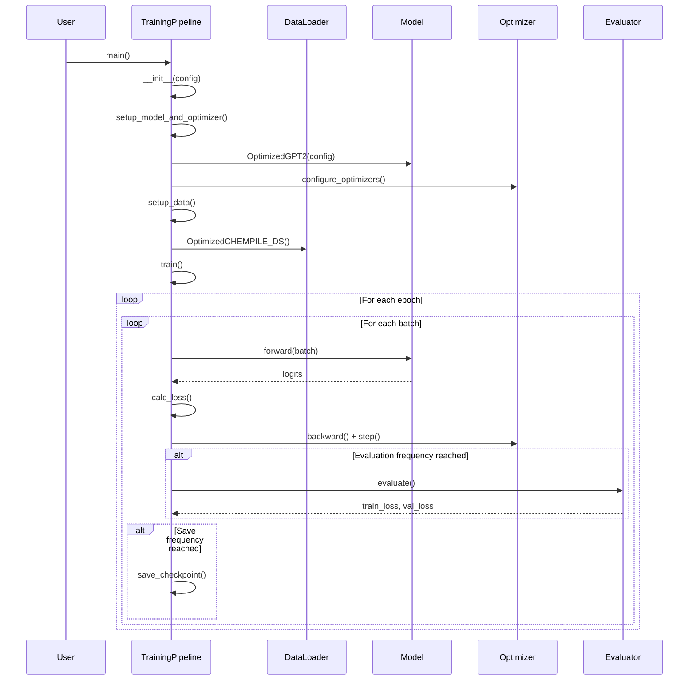
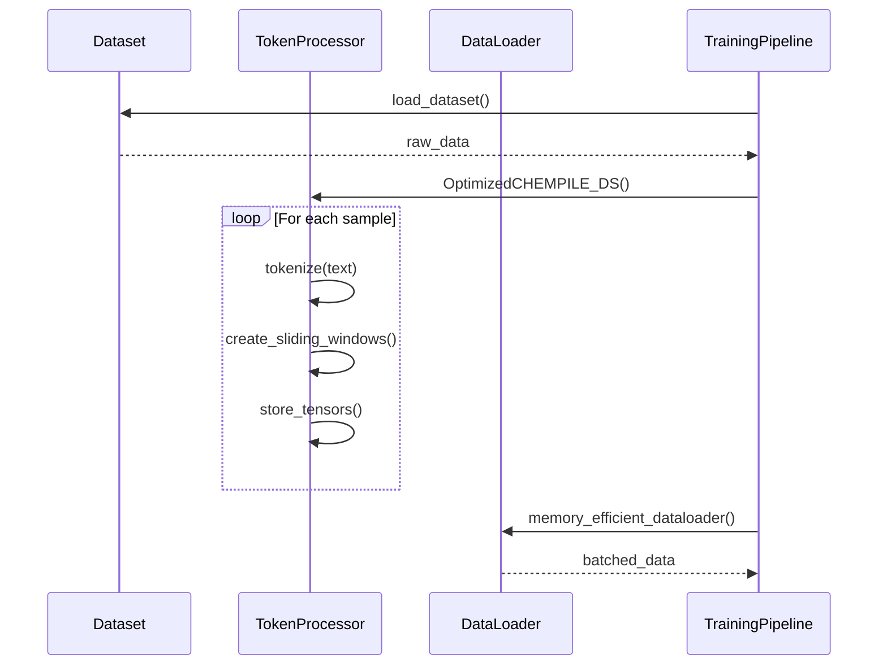
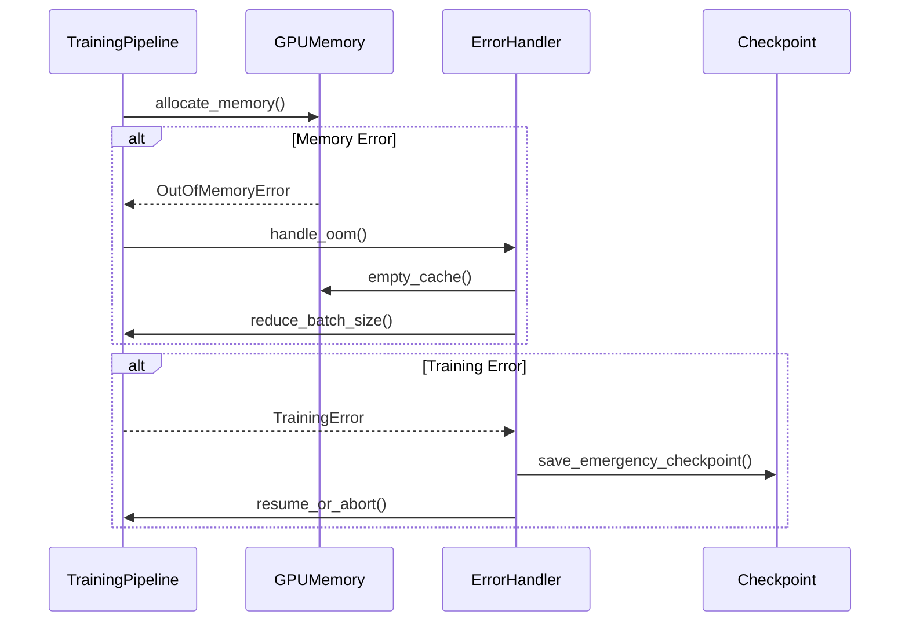

# Design Analysis Document

## 1. Current Architecture Summary

The existing codebase consists of a monolithic training pipeline with multiple optimization modules scattered across separate files. The current architecture includes:

### Core Components:
1. **TrainingPipeline Class** (`optimized_training_complete.py`): Main orchestrator that handles the entire training workflow
2. **Model Architecture** (`gpt2model.py`, `model_optimizations.py`): Basic GPT-2 implementation and optimized variants
3. **Performance Modules**: Scattered optimizations across multiple files:
   - `performance_improvements.py`: Dataset, loss calculation, and training loop optimizations
   - `batch_optimization.py`: Memory and batch size optimization strategies
   - `optimizer_improvements.py`: Learning rate scheduling and optimizer configurations
   - `model_optimizations.py`: Model architecture improvements

### Data Flow:
```
Dataset Loading → Data Processing → Model Setup → Training Loop → Evaluation → Checkpointing
     ↓              ↓                ↓              ↓             ↓           ↓
 CHEMPILE      OptimizedCHEMPILE   OptimizedGPT2   Mixed        Loss       Model State
 Dataset       Dataset             Model          Precision    Calculation   Persistence
```

### Current Issues:
- **Tight Coupling**: TrainingPipeline directly imports and uses all optimization modules
- **Monolithic Design**: Single class handles data loading, model setup, training, evaluation, and checkpointing
- **Hard Dependencies**: Direct imports make testing and modularity difficult
- **Configuration Spread**: Model and training configurations are scattered throughout the codebase
- **Limited Extensibility**: Adding new features requires modifying multiple files

## 2. Sequence Diagrams

### Primary Training Flow


### Data Processing Flow


### Error Handling Flow


## 3. Architectural Assessment

### Identified Patterns:
1. **Monolithic Architecture**: Single TrainingPipeline class handles all responsibilities
2. **Utility Pattern**: Separate modules provide utility functions without clear interfaces
3. **Configuration Pattern**: Configuration dictionaries passed through components
4. **Template Method Pattern**: Training loop follows a fixed template with customizable steps

### Potential Issues:

#### 1. Tight Coupling
- **Problem**: TrainingPipeline directly imports all optimization modules
- **Impact**: Makes testing difficult, reduces modularity, hard to swap implementations
- **Evidence**: `from performance_improvements import *` style imports

#### 2. Single Responsibility Principle Violation
- **Problem**: TrainingPipeline handles data loading, model setup, training, evaluation, and persistence
- **Impact**: Large, complex class that's hard to maintain and extend
- **Evidence**: 400+ line class with multiple distinct responsibilities

#### 3. Poor Extensibility
- **Problem**: Adding new optimizers, data sources, or evaluation metrics requires modifying multiple files
- **Impact**: Difficult to experiment with new techniques or adapt to different use cases
- **Evidence**: Hard-coded optimizer and data loading logic

#### 4. Configuration Management Issues
- **Problem**: Configurations scattered across multiple locations
- **Impact**: Inconsistent configuration handling, difficult to manage different experiment setups
- **Evidence**: CONFIG_6GB and CONFIG_124M defined in main file, other configs in separate modules

#### 5. Testing Challenges
- **Problem**: Tight coupling makes unit testing individual components difficult
- **Impact**: Reduced code quality, harder to identify and fix bugs
- **Evidence**: No visible test structure, monolithic design prevents isolated testing

#### 6. Performance Bottlenecks
- **Problem**: Mixed concerns in performance-critical code paths
- **Impact**: Harder to optimize individual components
- **Evidence**: Training loop mixes logging, evaluation, and persistence with core training logic

### Areas for Improvement:

#### 1. Modular Architecture
- **Goal**: Separate concerns into distinct, loosely coupled modules
- **Approach**: Implement dependency injection and interface-based design
- **Benefits**: Improved testability, flexibility, and maintainability

#### 2. Strategy Pattern Implementation
- **Goal**: Make optimizers, data sources, and evaluation strategies pluggable
- **Approach**: Define interfaces for key components and implement concrete strategies
- **Benefits**: Easy experimentation with different techniques

#### 3. Configuration Management
- **Goal**: Centralized, type-safe configuration management
- **Approach**: Implement configuration classes with validation
- **Benefits**: Consistent configuration handling, easier experiment management

#### 4. Pipeline Pattern
- **Goal**: Break training process into discrete, composable stages
- **Approach**: Implement processing pipeline with clear stage interfaces
- **Benefits**: Better separation of concerns, easier to add new processing steps

#### 5. Observer Pattern for Monitoring
- **Goal**: Decouple performance monitoring from core training logic
- **Approach**: Implement event-driven monitoring system
- **Benefits**: Cleaner training loop, flexible monitoring options

#### 6. Factory Pattern for Component Creation
- **Goal**: Standardize component creation and configuration
- **Approach**: Implement factories for models, optimizers, and data loaders
- **Benefits**: Consistent component creation, easier to manage complex configurations

### Recommended Refactoring Strategy:
1. **Extract Interfaces**: Define clear contracts for major components
2. **Implement Dependency Injection**: Remove direct dependencies between modules
3. **Create Component Factories**: Standardize component creation
4. **Implement Pipeline Architecture**: Break training into composable stages
5. **Add Configuration Management**: Centralize and validate configurations
6. **Integrate Monitoring System**: Implement event-driven performance tracking

This refactoring will significantly improve code maintainability, testability, and extensibility while maintaining the performance optimizations already implemented.
